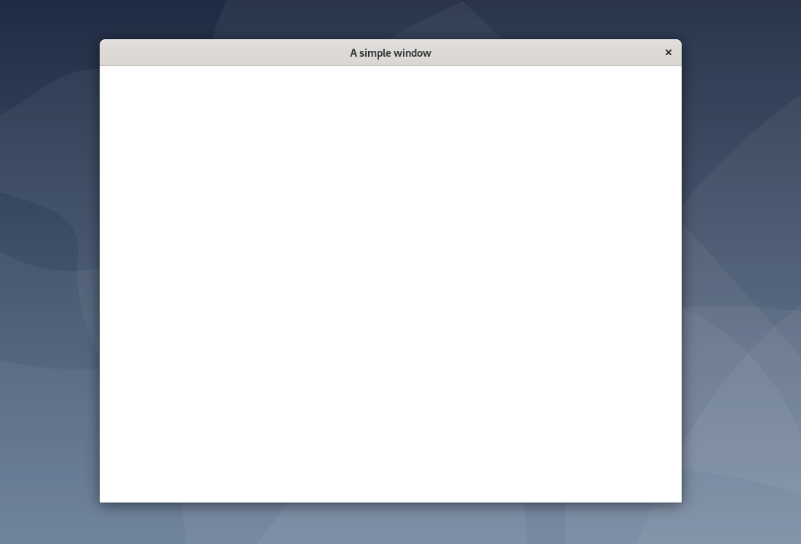

# ion Examples

Each of these are video game prototypes that demonstrate various features
of using the ion library.

## Building

Each example has similar build instructions to the library, for example, from
the simple directory:

```sh
mkdir build && cd build
cmake ..
cmake --build .
./simple
```

## Examples

#### Simple

A simple demonstration of the basic ion features needed to get a game up and
running. A statically rendered mathy color gradient.



#### Muncher

A classic arcade game of big-fish/little-fish, eat or be eaten. Move around a
screen and avoid large objects while eating smaller objects and growing.

#### Pipes

The skeleton of a pipe puzzle game, loosely inspired by Simon Tatham's net, and
mechanically similar to [Dorfromantik](https://toukana.com/dorfromantik/).
